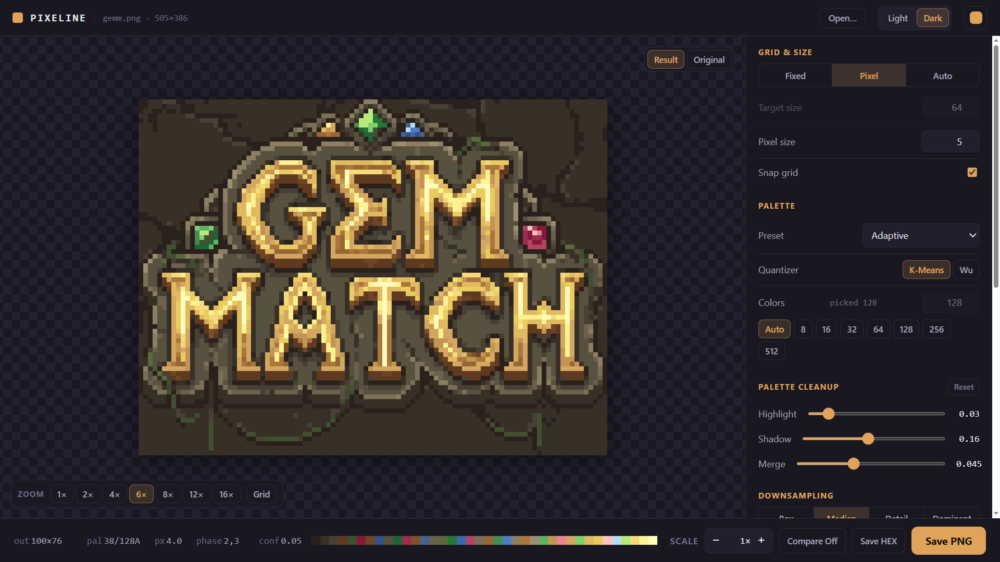
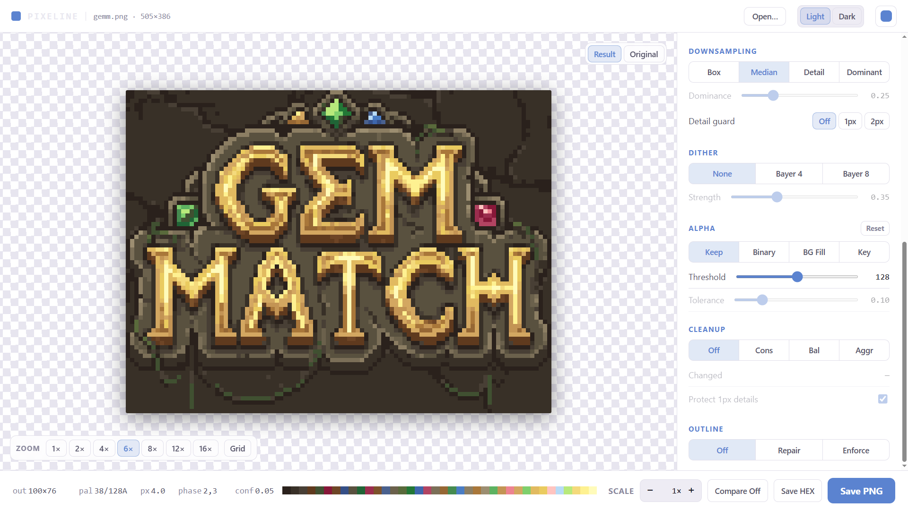

# Raster to Pixel

Rust CLI and local GUI for converting fuzzy raster images into deliberate pixel-art PNGs.

Licensed under MIT. See `LICENSE` and `NOTICE`.

## GUI

```cmd
cargo run --bin gui -- --chrome
```





## Quick Start

```cmd
cargo run --bin raster_to_pixel -- input.png output.png --pixel-size 5 --colors 16 --scale 8
```

Auto pixel-size:

```cmd
cargo run --bin raster_to_pixel -- input.png output.png --auto-pixel-size --colors 16 --scale 8
```

Fixed palette:

```cmd
cargo run --bin raster_to_pixel -- input.png output.png --pixel-size 5 --palette pico8 --dither bayer4 --scale 8
```

Compare sheet:

```cmd
cargo run --bin raster_to_pixel -- input.png compare.png --pixel-size 5 --colors 16 --scale 8 --compare
```

Batch folder:

```cmd
cargo run --bin raster_to_pixel -- examples batch_out --auto-pixel-size --auto-colors --scale 8 --palette-out palettes
```

Palette export:

```cmd
cargo run --bin raster_to_pixel -- input.png output.png --auto-pixel-size --auto-colors --palette-out palette.hex
```

Useful knobs:

```cmd
--pixel-size 5      :: estimated source pixels per output pixel
--auto-pixel-size   :: estimate source pixels per output pixel from image structure
--size 64           :: target long side, ignored when --pixel-size is set
--colors 16         :: adaptive palette size
--auto-colors       :: pick the adaptive color count automatically (16/32/64/128/256)
--quantizer kmeans  :: adaptive palette algorithm: kmeans or wu (Wu 1992, Oklab lattice)
--palette-merge .04 :: merge adaptive palette entries closer than this Oklab distance
--palette pico8     :: built-in palette: pico8, gameboy, sweetie16
--palette file.hex  :: Lospec-style RRGGBB hex list or GIMP .gpl palette
--dither none       :: no dithering
--dither bayer4     :: ordered 4x4 Bayer dithering
--dither bayer8     :: ordered 8x8 Bayer dithering
--dither-strength .35
--scale 8           :: nearest-neighbor preview scale
--cell detail       :: box, median, detail, or dominant
--dominant-threshold .25
--highlight-collapse .03
--shadow-collapse .16
--alpha-mode preserve :: preserve, binary, background-fill, or color-key
--bg-tolerance .10  :: color tolerance for background-fill / color-key
--color-key 00ff00  :: key color for --alpha-mode color-key
--cleanup none      :: none, conservative, balanced, or aggressive morphology cleanup
--no-protect-details :: let cleanup remove repeating single-pixel details too
--contrast-expansion 1 :: protect tiny high-contrast details from downsampling (0-4)
--outline none      :: none, repair (fill outline gaps), or enforce (full dark edge)
--no-snap-grid      :: disable grid phase snapping for pixel-size modes
--phase-x 2         :: manual grid phase override (also --phase-y)
--debug-json d.json :: write grid/palette/cleanup diagnostics as JSON
--debug-grid g.png  :: write the source with the sampling grid drawn on it
--palette-out p.hex :: write the result palette as .hex, .gpl, or a 1-row .png strip
--compare           :: write original/result side-by-side
```

If `input` is a directory, Pixeline batch-converts supported images from that
folder into the output directory. In batch mode, `--palette-out`, `--debug-json`,
and `--debug-grid` are directories for per-image sidecars.

In the GUI, custom palettes are pasted into the `Custom...` palette box. The
parser accepts Lospec `.hex` text and GIMP `.gpl` text.

## How It Works

The pipeline picks a target grid, downsamples in linear RGB, quantizes in Oklab,
optionally applies Bayer dithering, then writes the raw grid or a nearest-neighbor
scaled preview.

The default `detail` cell mode chooses between median and dominant per cell:

- Median uses the per-channel median as a target, then snaps to the nearest real
  source color from that cell. This avoids synthetic fringe colors.
- Dominant groups near colors into two shifted 32-level RGB bucket grids (so a color
  family straddling a bucket boundary is never split), picks the stronger winner,
  snaps its weighted mean to a real cell color, and falls back to a box average when
  the winner is below `--dominant-threshold`.
- Cells use fractional coverage weights and alpha-weighted color stats, so partial
  source pixels and transparent edges are handled consistently.
- Pixel-size modes can snap the sampling grid to the strongest detected edge phase
  (with a reported confidence), which helps when the source grid is offset by a few
  pixels; `--phase-x`/`--phase-y` override the detection.
- Adaptive palettes merge generated near-white and near-black noise before k-means.
  Near-whites collapse to white; near-blacks collapse to the darkest source color
  instead of inventing pure black.

Optional cleanup stages:

- `--alpha-mode` prepares the source before conversion: `binary` hardens soft alpha,
  `background-fill` flood-fills the background from the image border with
  `--bg-tolerance` (enclosed islands survive), `color-key` keys out one color.
  Everything made transparent is decontaminated to `[0,0,0,0]`.
- `--cleanup` runs opt-in morphology on the finished grid: fill enclosed pinholes,
  drop light matte halos along edges, remove diagonal jaggy nubs, and delete
  isolated specks. Single-pixel details that repeat nearby are protected by default.
- `--quantizer wu` swaps the adaptive palette builder for Wu 1992 moment
  quantization running on an Oklab lattice — often better at separating dominant
  color families at 16-64 colors. `--palette-merge` then collapses any surviving
  near-duplicate entries, keeping the heaviest real color of each group.
- `--contrast-expansion N` stamps tiny high-contrast details (eye pixels, glints)
  over their surroundings before downsampling so the cell vote cannot erase them.
- `--outline repair` detects the sprite's dark outline color along the silhouette
  and fills single-pixel gaps; `enforce` repaints the entire silhouette edge.
